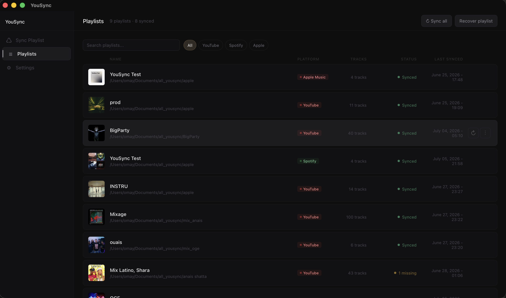
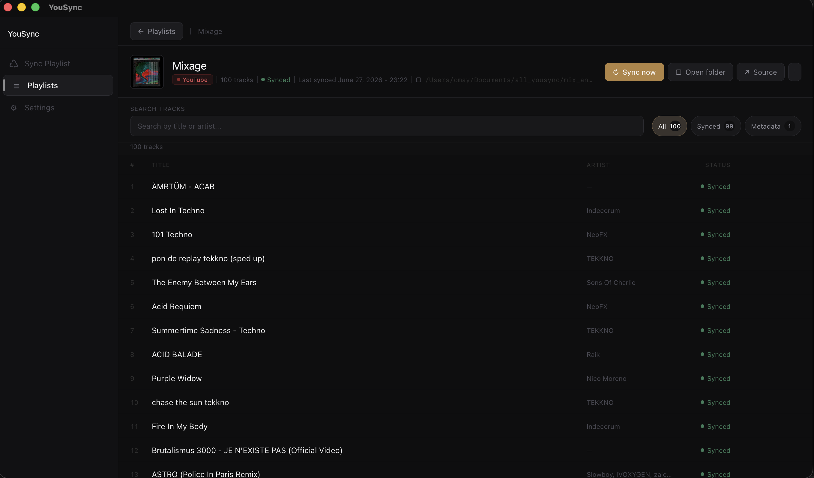

<p align="center">
  <strong>Synchronize your music playlists with your computer.</strong><br>
  Download your playlists locally, keep them organized, and update them again later with one click.
</p>

<p align="center">
  <a href="https://yousync-app.github.io/">Official website</a>
  ·
  <a href="../../releases">Download</a>
  ·
  <a href="../../issues">Report an issue</a>
</p>

---

## About

YouSync is a desktop application that lets you synchronize supported music playlists to a local folder on your computer.

Add a playlist URL, choose where it should be saved, and YouSync downloads the songs in MP3 format while retrieving useful metadata such as the title, artist and cover image. Once a playlist has been added, you can synchronize it again later to download missing tracks and keep the local folder up to date.

YouSync is distributed under the MIT License.

---

## Preview

<p align="center">
  
</p>

<p align="center">
  
</p>

---

## Features

- **Playlist synchronization**: add a playlist once, then synchronize it again later with one click.
- **Local MP3 download**: save playlist tracks locally in MP3 format.
- **Metadata retrieval**: automatically add metadata such as title, artist and cover artwork when available.
- **Playlist library**: view all saved playlists from the app.
- **Platform filters**: filter your playlists by source platform.
- **Platform thumbnails**: quickly identify where each playlist comes from.
- **Multiple playlists per folder**: organize several playlists inside the same destination folder.
- **Playlist recovery**: recover playlists from an existing folder containing YouSync data.
- **Useful shortcuts**: open the local playlist folder or the original playlist link directly from the playlist page.
- **Packaged installers**: no Python installation is required when using the packaged app.

---

## Supported platforms

| Platform | Status |f
| --- | --- |
| YouTube | Supported |
| Spotify | Supported |
| Apple Music | Supported |
| Deezer | Supported Soon ! |
| SoundCloud | Not supported |

SoundCloud synchronization is not currently available. It is not listed as an upcoming feature until a reliable implementation is possible.

---

## Compatibility

| Operating system | Status |
| --- | --- |
| Windows | Supported and tested |
| macOS | Available through a DMG installer |
| Linux | Not officially supported yet |

On macOS, the application may be blocked on first launch if the build is not notarized. In that case, open it with **Right click > Open**, or allow it from **System Settings > Privacy & Security**.

---

## Installation

### Windows

1. Go to the latest GitHub release.
2. Download the Windows installer.
3. Run the installer and follow the setup steps.
4. Launch YouSync from the Start menu or from the installation folder.

### macOS

1. Go to the latest GitHub release.
2. Download the macOS `.dmg` installer.
3. Open the DMG file.
4. Drag `YouSync.app` into the `Applications` folder.
5. Launch YouSync from Applications.

If macOS displays a security warning because the app is not notarized, use **Right click > Open** on the app the first time you launch it.

---

## Usage

1. Open YouSync.
2. Choose the playlist platform.
3. Paste the playlist URL.
4. Select the local folder where the playlist should be saved.
5. Save the playlist.
6. Use the synchronization button whenever you want to update it again.

YouSync stores playlist information inside a `.yousync` folder in the selected destination folder. This allows the app to recover and update existing playlists later.

---

## Technical details

- **Core language**: Python
- **Desktop packaging**: native desktop installer builds for supported operating systems
- **Download and metadata logic**: Python worker responsible for playlist parsing, audio download and metadata processing
- **Data storage**: playlist information is stored locally in `.yousync` folders as JSON data
- **Main libraries used**: `pytubefix`, `selenium`, `Pillow`, `eyed3`, `moviepy`, `beautifulsoup4`, `lxml`

---

## Legal notice

YouSync is intended to help users manage and synchronize their own playlists locally.

Users are responsible for how they use the application and for complying with the terms of service of each platform, copyright laws, and any applicable regulations. This project does not encourage or support the unauthorized downloading or distribution of copyrighted material.

---

## Contributing

Contributions are welcome.

1. Fork the repository.
2. Create a feature branch:

```bash
git checkout -b my-new-feature
```

3. Commit your changes:

```bash
git commit -m "Add new feature"
```

4. Push your branch:

```bash
git push origin my-new-feature
```

5. Open a pull request.

---

## License

This project is licensed under the MIT License. See the [LICENSE](LICENSE) file for details.

---

Thank you for using YouSync. If you have questions, ideas or bug reports, feel free to open an issue on GitHub.
